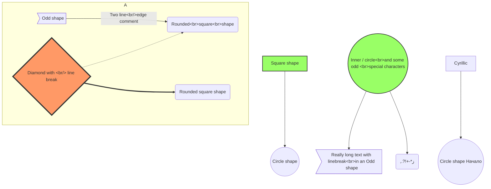
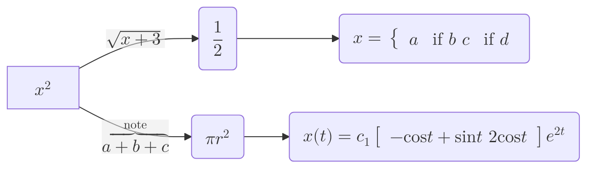

# References

- [Mermaid Diagrams Syntax](https://mermaid.js.org/intro/){:target="_blank"}
- [Mermaid Examples](https://docs.mermaidchart.com/mermaid-oss/syntax/examples.html){:target="_blank"}

# Examples

